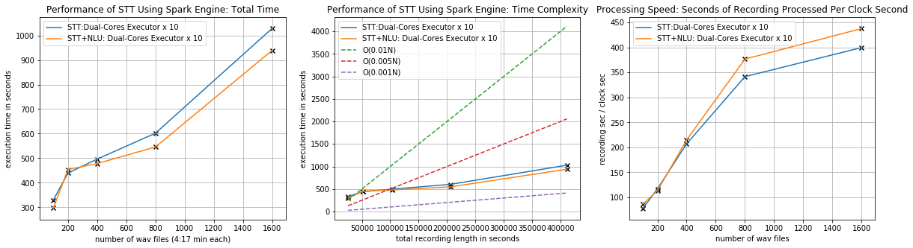

# Watson Transformer
Watson Transformer solves the problem of consuming IBM Watson API services([STT](https://cloud.ibm.com/apidocs/speech-to-text), [NLU](https://cloud.ibm.com/apidocs/natural-language-understanding), etc.) at scale by wrapping the service calls into the Spark transformer. In this way, The IBM services such as STT and NLU can build into the Spark ML pipeline, along with other transformers and estimators to tackle the big data challenge. 

# Install
```
pip install waston-transformer
```

# Design
As the UML chart illustrates, The Watson Transformer Class service as a thin wrapper around the IBM Waston API class. For extensibility purposes, the logic of consuming API service is defined in the Watson Service Class, which is an executable class. It enables any applicable API service to be wrapped into the transformer. On the other hand, the transformer handles mapping input data to API calls and parse the service response to data fields. 

  

# Performance

* __Experiment 1__: This experiment compares the performance of using the regular UDF and the vectorized UDF with pyArrow enabled. The testing cluster is provisioned with 10 2vCPU/2GB nodes, and the time cost is recorded on nine datasets which contain [100,200,400,800,1600] recordings respectfully. The maximum number of worker threads a vectorized UDF can spam is 10, therefore the maximum QPS(query/sec) of the vectorized UDF transformer is 200.  

 

* The result suggests:
  * Vectorized UDF: the time complexity is between **O(0.001N)** and **O(0.005N)** <sub>*N = total recording seconds in the dataset*</sub>
  * Regular UDF: the time complexity is slower than **O(0.01N)** <sub>*N = total recording seconds in the dataset*</sub>
  * Vectorized UDF is more than **10x** faster than using regular UDF clock and can process **~400** recording seconds.


* __Experiment 2__: This experiment benchmark the performance of pySpark ML pipeline build using different Watson transformers provided by this package. The testing cluster is provisioned the same as it in the first experiment. The maximum QPS of STT and NLU transformer is 200. Here is configuration of the two ML pipelines:
  * STT pipeline: [STT => JSON_Transformer]
  * STT + NLU pipeline: [STT => JSON Transformer => NLU => JSON Transformer => Nested Column Transformer]

 

* The result suggests:
  * The STT transformer dominates the time cost in the whole pipeline.
  * The time complexity of two pipelines are between **O(0.005N)** and **O(0.01N)**, <sub> *N = total recording seconds in the dataset* </sub>
  * 1 clock second can process **~140** recording seconds
  * Speed up ~ **40X** comparing to sequential case.


# Tutorial

.... to be added
